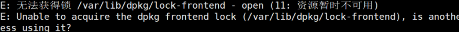
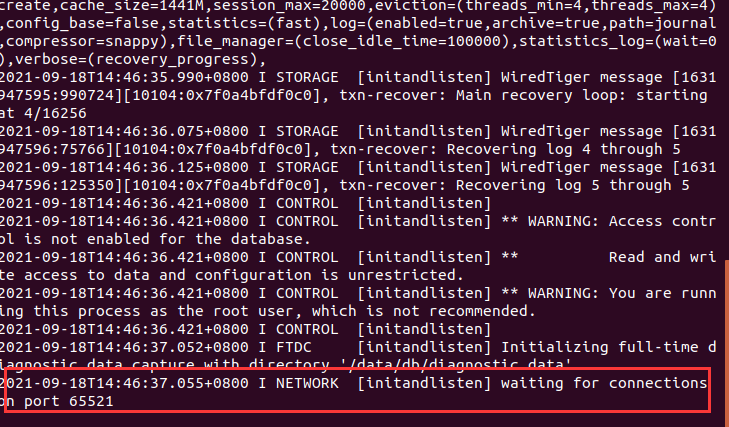
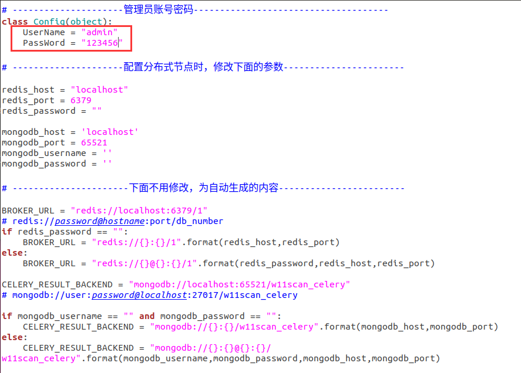
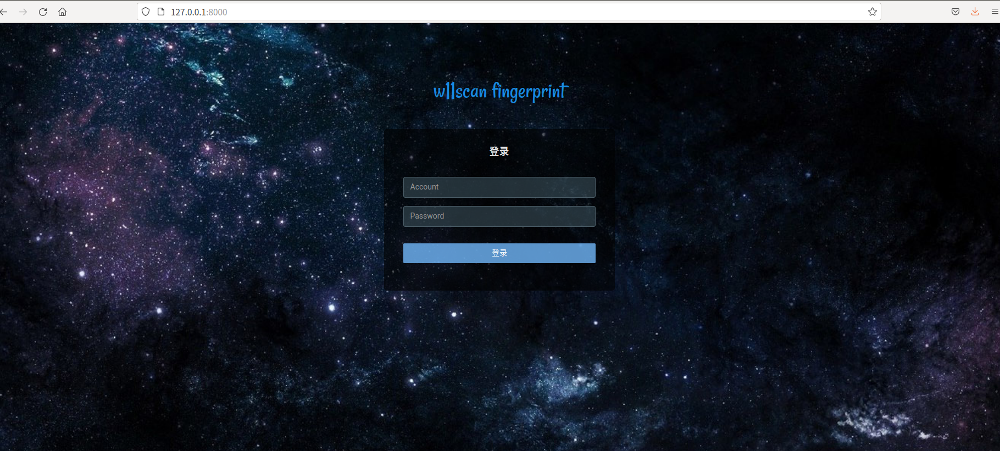
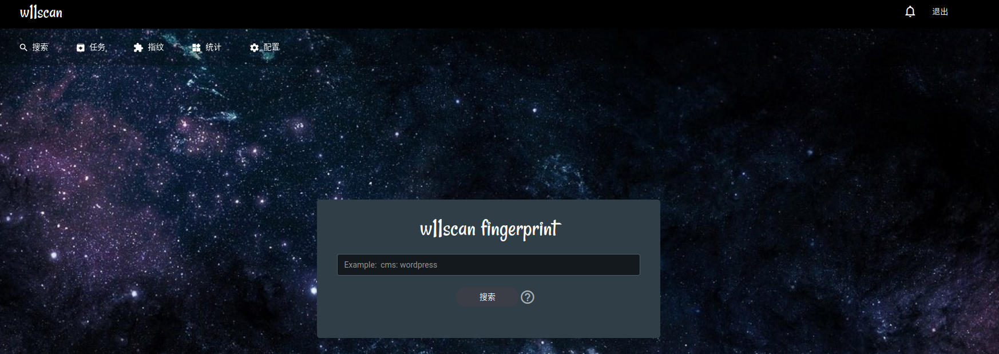
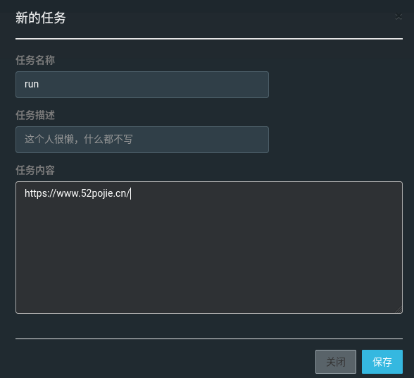
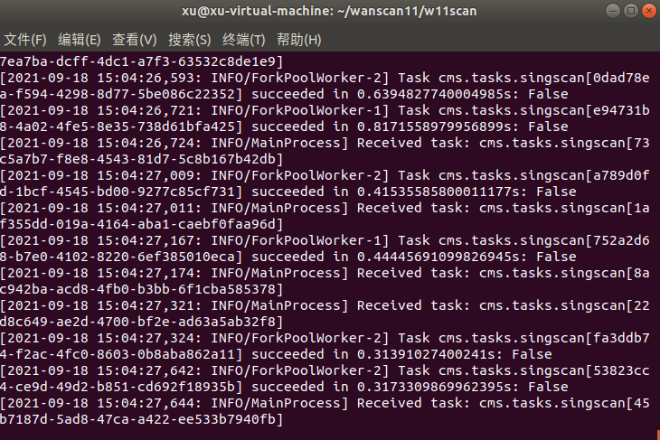
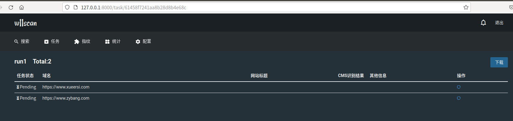
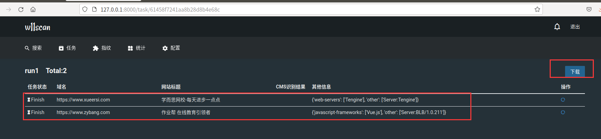

# W11scan工具的使用

## 一、工具介绍

```java
	w11scan是一款分布式的WEB指纹识别系统（包括CMS识别、js框架、组件容器、代码语言、WAF等等），管理员可以在WEB端新增/修改指纹，建立批量的扫描任务，并且支持多种搜索语法。
```

## 二、安装步骤

由于W11scan是作者从一个纯净的ubuntu上安装的，因此我们最好选用ubuntu系统，这里我们测试的是ubuntu18.0

### 1.安装python3、pip，下载软件并安装依赖

```python
sudo apt install -y python3 python3-pip python-celery-common git
git clone https://github.com/boy-hack/w11scan
cd w11scan
pip3 install -r requirements.txt
```

我们在安装requirements.txt中模块时，可能会提示一些模块的版本过低，我们可以采用pip安装，或单独安装这些模块

### 2.安装redis、mongodb、导出指纹数据

```
sudo apt install -y redis-server mongodb 
sudo mkdir -p /data/db  # 建立Mongodb存储目录
```

我们需要让mongodb在65521端口上运行，先停止mongodb

```
service mongodb stop
```

再启动

```
sudo mongod --bind_ip 127.0.0.1 --port 65521
```

我们启动时可能会报错误



解决办法：

```
一、两种解决方法

　　（1）杀掉apt-get进程：
　　　　ps aux | grep apt-get
　　　　sudo kill PID
　　　
　　（2）强制解锁：
　　　　sudo rm /var/cache/apt/archives/lock
　　　　sudo rm /var/lib/dpkg/lock
经检测第二种方法会有用
```



我们可以发现此时我们的数据库已经监听在65521端口上了

接着导入指纹

```
mongorestore -h 127.0.0.1 --port 65521 -d w11scan backup/w11scan
```

接着输入`mongo --port 65521`进入mongodb shell
	`show dbs` 查看是否有w11scan数据库创建，有则创建成功。
	接着对结果进行全文索引。 依然在mongodb shell状态下

```
use w11scan_config
db.result.createIndex({"$**":"text"})
```

完成后`exit`退出

### 3.软件config配置

1. 修改config.py，按照提示配置redis、mongodb用户名密码(如果按上面操作进行的，默认即可)

   

2.生成django的session

```
python3 manage.py migrate
```

### 4.运行WEB端

```java
python3 manage.py runserver //默认账号密码: admin w11scan
```





### 5.运行节点

```
celery -A whatcms worker -l info
```

然后我们可以新建任务，开始检测



我们可以发现我们的节点指纹就在不断的检测：





我们只需要等待时间，就可以将我们需要的信息扫描显示出来



## 三、使用

我们安装完成之后再次使用：

```java
service mongodb stop //先停止mongodb
sudo mongod --bind_ip 127.0.0.1 --port 65521 //再启动
python3 manage.py migrate
python3 manage.py runserver
celery -A whatcms worker -l info
```

## 四、实验总结

本文主要是对W11scan工具的介绍和使用记录，详细大家可以参考原作者的github地址：https://github.com/w-digital-scanner/w11scan

